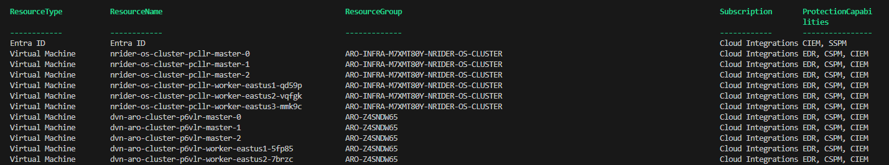
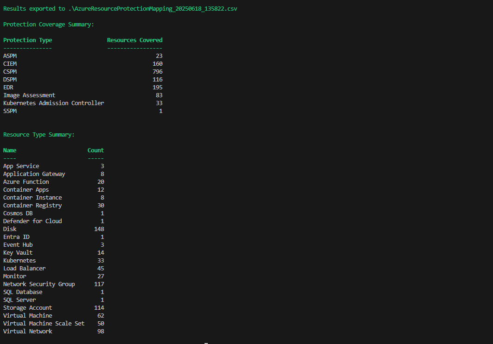

# CrowdStrikeAzureProtectionDiscovery
PowerShell script that will crawlall subscriptions in a tenant and output what protection would be provided by the CrowdStrike platform

## Example Output

## Results

